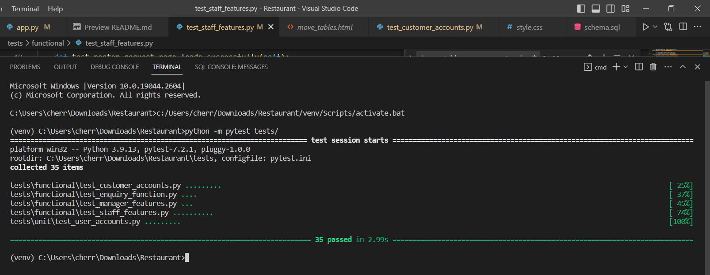

# Michelin Star Software

## Project Dependencies Information

- ✅ `Up-to-date dependencies`: This project uses the pip package manager to manage dependencies
- ✅ `Database`: `MySQL`, the project uses MySQL as its database management system.
- ✅ `DB Tools`:`flask_mysqldb`, flask_mysqldb is a Flask extension that simplifies the process of connecting to a MySQL database from a Flask application.
  
<br />

## Manual Build

<br />

### 1. Environment Set Up for `Windows`, `Unix`, `MacOS`

<br />

> **Step 1** Download the code 

```bash
$ git clone https://github.com/emmar266/Restaurant.git
$ cd Restaurant
```

<br />

> **Step 2** - Create a `virtual environment`

> Install modules via `VENV` 

```bash
$ py -3 -m venv venv
```

<br />

> **Step 3** - Activate the `virtual environment`

```bash
$ .\venv\Scripts\activate 
```

<br />

> **Step 4** - Install the dependencies

> Install modules via `VENV`

```bash
$ pip install -r requirements.txt
```

<br />

### 2. Set up and connect to a database

<br />

> **Step 1** - Create a MySQL database using your preferred editor

> **Step 2** - Create a python file called `credentials.py`

> **Step 3** - Configure the connection parameters in `credentials.py`, as below:

```python 
1 user="your_username"
2 host="your_hostname"
3 db="your_database_name"
4 password="your_password" 
```

<br />

### 3. Set up for database

<br />

> **Step 1** - Copy all the SQL from `schema.sql`, located in the root directory of this project

> Then paste the code in your preferred editor for SQL development

> **Step 2** - Run the code once in your editor to populate your schema

<br />

### 4. Set up for `Flask-Mail`

<br />

> **Step 1** - Go to your newly created python file called credentials.py

> **Step 2** - Allow 3rd party access on your gmail account.

> For more details, [click here](https://support.google.com/accounts/answer/3466521?hl=en#:~:text=Go%20to%20the%20Security%20section,service%20you%20want%20to%20review).

> **Step 3** - Add in two new variables and fill in your details as follows:

```python 
5 flask_email='your_email'
6 flask_email_password='password_generated_by_google_that_is_usable_by_3rd_party_apps'
```

<br />

### 5. Running the application

<br />

> Starting the Flask app

```bash
$ python3 -m flask run
// OR
$ flask run
```

At this point, the app runs at `http://localhost:8080` or `http://127.0.0.1:5000/`

<br />

## Testing  - Set Up for `Windows`, `Unix`, `MacOS`

<br />

> **Step 1** Ensure all dependencies are downloaded

```bash
$ pip install -r requirements.txt
```
<br />

> **Step 2** Set up the config file

> Navigate to the `tests` directory and create a file called `config.py`

<br />

> **Step 3** - Configure the connection parameters in `config.py`, as below:

```python 
1 MYSQL_USER = "your_username"
2 MYSQL_PASSWORD = "your_password"
3 MYSQL_DB = "your_schema"
4 MYSQL_PORT = "your_port_number"
5 MYSQL_HOST = "your_host"
6 AUTH='mysql_native_password'
7 T1='customer'
8 T2='staff'
9 config = {
10    'host': "your_host" ,
11    'user': "your_username",
12    'password': "your_password",
13    'database': "your_schema",
14    'auth_plugin':'mysql_native_password'
15 }
```
<br />

> **Step 4** Run the tests in the terminal

```bash
$ python -m pytest tests/
// OR
$ pytest
```

<br />

> Test Results



<br />

### Create Users

By default, the app redirects guest users to authenticate. In order to access the more interesting pages, follow this set up: 

- Start the app via `python3 -m flask run`
- Access the `registration` page and create a new user:
  - `http://127.0.0.1:5000/registration`
- Access the `sign in` page and authenticate
  - `http://127.0.0.1:5000/customer_login`
- To access as a manager, navigate to the the `staff login` page and authenticate with the following details
  - username: `manager`
  - password: `123456`

  Please change your email and password upon log in

<br />

## Code-base structure

> some tree

<br />

## Credits To Flask Datta Able and Mr. Web Designer

The majority of our CSS was taken from the Flask Datta Able Open-Source Jinja templates tool. We modified the CSS and JS to what suited us best.

We also took some CSS from Mr. Web Designer for our menu webpage.

More details below on the two sources.

1. Open-source **Flask Dashboard** generated by `AppSeed` on top of a modern design. **[Datta Able](https://appseed.us/product/datta-able/flask/)**

2. Open-source **Food Website** - fully responsive food website using html, css and vanilla javascript. **[Mr. Web Designer](https://morioh.com/p/2abc8316f5ed)**
